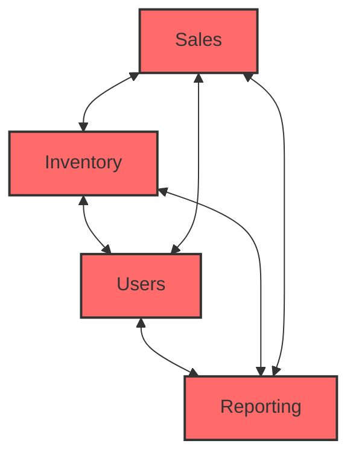
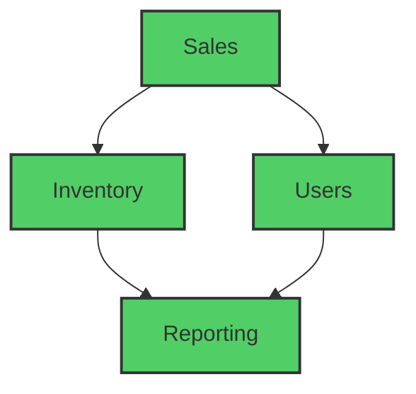

Monoliths are often dismissed as “legacy” or “not cloud-ready.” In practice, what hurts most teams isn’t the fact that an application is deployed as a single unit — it’s the lack of modularity inside that unit. This article breaks down the different kinds of “monoliths” we encounter and why **a modular monolith is often the best default**.

**TL;DR:** Monolith vs microservices is less important than modular vs non-modular. A *modular monolith* (clear contracts, one-way dependencies, no cycles) is reliable to build and evolve, and is also the cleanest starting point if/when you later extract microservices.

A monolith is a geological feature consisting of a single massive stone or rock, such as a mountain ([Wikipedia](https://en.wikipedia.org/wiki/Monolith)).

In software, the term “monolith” is usually used to describe **how an application is packaged and deployed** (a single deployable unit). “Modular” vs “non-modular” describes **how the code inside is structured** (boundaries, contracts, dependencies).

## What people usually mean by a monolith

* Application with a single module or multi-module large code base.
    
* It is deployed as a single application (one deployable unit).
    
* Higher throughput is often achieved by vertical scaling and/or by running multiple full instances.
    
* Horizontal scaling of the application means deploying multiple instances of the complete application.
    
* Single build, deployment/release pipeline.
    

Monolithic designs have worked successfully for years. With the advent of cloud platforms, many organizations moved toward microservices, but monoliths still remain a very practical choice in many scenarios.

## Use cases for a monolith application

* An application that is not distributed multi-regional and/or multi-tenant and not expecting varying unlimited loads can be successfully developed and delivered as a monolith.
    
* Organizations on a budget, with a small team and a need for fast time-to-market, can start with a monolith and still deploy it to cloud or on-premise with a predictable overall cost.
    
* Many enterprise applications are developed and operated as monoliths (often with multiple internal modules).
    

## Where monoliths hurt

* Individual components or modules cannot scale independently. For example, if a “sales” module gets a seasonal traffic spike compared to “inventory” or “users”, you still need to scale the whole application.
    
* Horizontal scaling of the whole application can get costly, especially if all modules don’t need to be scaled out.
    

## What is a module?

A system is modular if it’s composed of independent, loosely coupled components integrated via well-defined interfaces and dependencies. A simple analogy is computer hardware: memory, storage, and USB are separate modules with a well-defined interface on the motherboard. Internals are hidden from other modules (encapsulation), and replacements are possible as long as the interface stays compatible.

Similarly, a software module should have:

* A clear responsibility/boundary
    
* A stable contract (API)
    
* Encapsulated internals (other modules shouldn’t rely on internal classes/tables/files)
    
* Intentional dependency direction (avoid cycles)
    

Modularity enables parallel development, testing, and releases with reduced complexity.

## Are monoliths bad?

There’s a common belief that monoliths are always bad and should be avoided. To reason about that, it helps to separate three patterns:

* **Non-modular monolith**: a single deployable with tight coupling and cyclic dependencies inside
    
* **Distributed monolith**: many deployables, but still tightly coupled (often through shared code, synchronized releases, and runtime/config coupling)
    
* **Modular monolith**: a single deployable with clean internal boundaries and one-way dependencies
    

### Non-modular monolith: symptoms and outcomes

This is the form that creates the impression that monoliths are painful, costly, and difficult to manage.

*Non-Modular Monolith: Cyclic dependencies and tight coupling between modules*

**Definition:**

**Single-module application:** A large multi-feature application where most code lives in a single “fat” module.

**Multi-module application (but non-modular in practice):** A large application split across modules, but with high coupling and circular dependencies. It may look modular, but behaves like a single tangled unit. This form is common.

**Characteristics and outcomes:**

* **Long builds:** Even in a multi-module setup, cyclic dependencies force sequential builds and frequent rebuilds.
    
* **CI instability:** In a single repo (or in the worst case, multiple repos), ambiguous dependencies surface during parallel merges, causing build/test failures.
    
* **Long validations:** Small changes require running “everything” because impact is unclear.
    
* **Test duplication:** Integration tests either become duplicated or incomplete.
    
* **Patch fixes over root-cause fixes:** Failures trigger chain reactions, making issues hard to isolate and leading to “safe” patching instead of improving design.
    
* **Vicious cycles:** Slow build/test/release cycles slow delivery; rushing changes by bypassing validations often increases defects.
    
* **Unreliable estimation:** Small changes carry hidden coupling, so timelines frequently slip.
    
* **Poor work distribution:** Without clear boundaries, work is hard to allocate; reviews and coordination increase; some people become overloaded while others are blocked.
    
* **Tooling won’t save architecture:** Teams may keep adding tools/technologies to compensate, while core dependency and boundary problems remain.
    
* **Team structure leaks into code:** “Reuse” and “common code” can easily break contracts and introduce cycles if boundaries aren’t enforced.
    
* **Too many stakeholders:** If a minor change requires broad coordination, it’s a sign boundaries/contracts aren’t working.
    
* **Unhealthy environment:** Constant firefighting and fear of change can degrade morale.
    

### Distributed monolith: coupling survives the split

* **Multiple non-modular monoliths:** The pain of a non-modular monolith pushes teams to look for a fix. Microservices are often chosen with the belief that “splitting the app splits the complexity”.
    
* In reality, when boundaries are unclear and dependencies are cyclic/ambiguous, complexity is copied into every service (shared code, synchronized releases, runtime coupling), and the original problems resurface in a harder-to-debug form.
    
* **Additional problems:** The application breaks into services, but the underlying coupling doesn’t. Build, deployment, runtime, and configuration dependencies still exist — they’re just harder to see and coordinate. What were previously in-process calls become network calls, increasing latency, failure modes, and operational complexity.
    
* **Upgrades are difficult:** As the same code exists in multiple services because of cyclic dependencies, every dependency version upgrade needs to be upgraded and tested across all services. This multiplies the workload and complexity.
    
* **Monolith Explosion:** The performance of the application will degrade if there are a high number of extra calls over the network due to obvious reasons. To match the original performance and reduce network calls, individual microservices can do some local calls as there is code duplication on each service, which means it needs to be vertically scaled to do more local processing. Hence more such non-modular monoliths are born, each having similar resource requirements as the original application, which will make the application costly and difficult to manage.
    

### Modular monolith: what good looks like

This is the form of monolith one should design and implement and also proves that monoliths are good and future-ready if done properly.

*Modular Monolith: Clear one-way dependencies, no cyclic dependencies*

**Definition:**

* A single deployable application with a large code base divided into modules with clear separation of responsibilities.
    
* Modules communicate over fixed and clearly defined contracts.
    
* Dependencies are intentional and one-way (no cycles).
    
* Internals and transitive dependencies are not “leaked” to dependent modules.
    

**Characteristics and outcomes:**

* Modules can exist in separate repositories. This enables faster merges and clearer ownership because teams mostly coordinate with direct dependencies/dependents.
    
* Modules can be built in parallel, reducing build time.
    
* Fixes are faster because you usually need to validate only the module and its direct dependencies/dependents.
    
* Integration tests can achieve high coverage with less duplication, improving confidence and efficiency.
    
* Effort estimates become more accurate because surprise coupling is rarer.
    
* Releases are more stable and more frequent, so confidence stays high.
    
* When teams ship continuously, credit is shared more fairly, which improves morale.
    
* Team size and development cost become more predictable. The fear of the unknown is reduced.
    
* Issues are easier to isolate. Failures can be contained within a module (or a known set of modules), while other modules degrade gracefully via well-defined contracts.
    
* Dependencies can be easily and independently upgraded as they are hidden from other modules.
    
* Teams get more time for new features because change and validation cycles are shorter.
    
* Modules can be enhanced, extended, replaced, or removed based on requirements.
    
* Hot modules (under heavy load) can be extracted into microservices and scaled independently.
    
* A modular monolith is the best starting point if you later need microservices.
    

**A practical checklist to aim for:**

* No cyclic dependencies (enforced by tooling)
    
* Stable module contracts (APIs) and versioning discipline
    
* Encapsulated internals (no “reaching into” other modules)
    
* Intentional dependency direction (layering or domain boundaries)
    
* The ability to build/test modules with fast feedback
    

**How to enforce this in practice:**

* Add tooling to enforce module dependency rules (and fail CI on violations).
    
* Treat contracts as first-class: document APIs, version them, and avoid leaking internals.
    
* Avoid “shared persistence”: don’t let other modules write directly to your module’s tables/collections.
    
* Keep cross-module communication explicit (public APIs/events), and measure it (module-level metrics).
    

## Conclusion

The application can be a monolith or microservices — **modularity is what determines long-term success**, whether on cloud or on-premise. A design is modular when contracts are defined and documented, external dependencies are explicit, and internal logic/dependencies are encapsulated behind clear boundaries.

Language/module features can help (for example Java’s module system from Java 9+, or JavaScript modules since ES2015), but the core work is still architectural: define boundaries, control dependency direction, and enforce contracts.